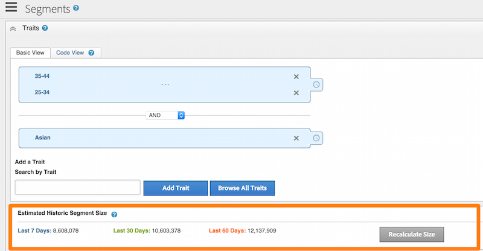

# 数据处理组件{#data-processing-components}

資料處理元件包括Hadoop、Snowflake、SOLR和Tableau。

<!-- 

c_comproc.xml

 -->

Audience Manager會使用下列元件來處理資料：

## hadoop {#hadoop}

在 [!DNL Audience Manager]，Hadoop是包含所有內容的主要資料庫 [!DNL Audience Manager] 瞭解使用者。 例如，當 [設定檔快取伺服器](../../reference/system-components/components-data-collection.md) 建立包含使用者相關資料的記錄檔，然後傳送該資料給Hadoop以供儲存。 其他重要的Hadoop元素包括：

* **配置單元：** hadoop的資料倉儲。 Hive會管理對儲存在Hadoop中之資料的隨選查詢。

* **HBase：** 非常大的Hadoop資料庫。 它會處理和管理傳入和傳出的資料、特徵規則、演演算法模型資訊，並執行許多與儲存資料以及將資料移動到不同系統相關的其他功能。

客戶無法直接存取這些系統。 不過，客戶確實會間接與他們合作，因為這些元件會儲存有關其網站訪客的重要資料。

## Snowflake {#snowflake}

[Snowflake](https://www.snowflake.net/) 是一個龐大的雲端資料庫。 它提供許多面板圖形及其相關文字方塊的資料，顯示圖形中每個專案的%變更。 如果您使用 [!DNL Audience Manager] 並檢視儀表板報表，您正在與提供的資料互動 [!UICONTROL Snowflake].

這絕不是完整的清單，而是一些常見的控制面板報告 [!UICONTROL Snowflake] 負責包括：

* [每日特征变化报表](/help/using/reporting/audience-optimization-reports/daily-trait-variation-report.md)
* 所有重疊報表(請參閱 [互動式報表](/help/using/reporting/dynamic-reports/dynamic-reports.md) 區段（以取得每個重疊報表的相關資訊）。
* [未使用的信号报表](/help/using/reporting/dynamic-reports/unused-signals.md)

## SOLR {#solr}

SOLR是來自Apache的開放原始碼資料庫和伺服器系統。 它提供強大且快速的搜尋功能，超越我們的大型資料集。 作為 [!DNL Audience Manager] 客戶，您可在建立區段時看到SOLR的實際運作情況。 它會提供資料給 [!UICONTROL Estimated Historic Segment Size] 報告。 SOLR由於其速度非常適合這個角色。 例如，SOLR可在您建立規則並將新特徵新增至區段時更新歷史大小資料。

## Tableau {#tableau}

[!DNL Audience Manager] 使用 [Tableau](https://www.tableausoftware.com/) 若要在中顯示資料 [互動式報表](../../reporting/dynamic-reports/dynamic-reports.md#interactive-and-overlap-reports) 和 [Audience Optimization報表](../../reporting/audience-optimization-reports/audience-optimization-reports.md). 互動式報表會顯示特徵和區段的效能和重疊資料。 它們不會使用以欄和列排列的數字，而是會使用不同的形狀、顏色和大小傳回資料。 此外，您可以選擇個別或資料點群組，並深入研究報告結果以取得更多詳細資訊。 這些視覺化技巧和報表互動有助於更容易瞭解大量數值資料。

