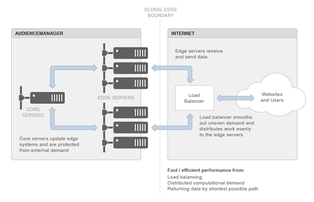

# 了解Edge数据中心{#understanding-the-edge-data-center}

Audience Manager使用分布式边缘计算拓扑来满足外部来源对我们的系统提出的需求。

## Edge数据中心基础知识 {#edge-data-center-basics}

<!-- 

c_compedge.xml

 -->

由于“边缘”本身就是全局边界，Edge计算提供了更好的性能，以应对广泛的、遍布整个互联网的需求。 这意味着[!DNL Audience Manager]将处理动态放在距离需求源最近的位置，并以最短的可能路径返回数据。 Edge计算有助于维护网站性能，进而保护您网站上的用户体验。 边缘数据中心是将数据移入和移出[!DNL Audience Manager]的关键网关。

[!DNL Audience Manager]边缘数据中心包括：

* **核心服务器：**&#x200B;这些是主[!DNL Audience Manager]系统。 它们会更新并向边缘服务器提供数据。

* **Edge服务器：**&#x200B;通常为应用程序和/或Web服务器。 它们位于[!DNL Audience Manager]与Internet之间的边界。 Edge服务器（如[!DNL DCS]或Akamai系统）通常处理流入和流出[!DNL Audience Manager]的数据和请求。

* **负载平衡器：**&#x200B;管理Internet应用程序固有的不均匀计算/处理需求。 这些平衡器可以防止服务器群集过载，而其他服务器则保持空闲状态。

下图说明了Audience Manager边缘数据中心环境。

## 地域分配和负载平衡 {#geo-dist-balance}

查看[数据收集组件](../../reference/system-components/components-data-collection.md)中的[!DNL DCS]部分。
