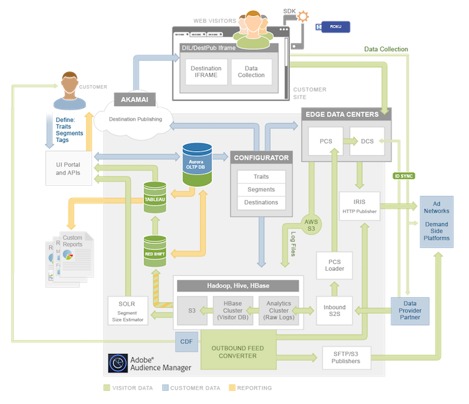

# 平台架构：数据流程图{#platform-architecture-data-flow-map}

此映射包含主要的Audience Manager系统。 它直观地呈现数据如何流入、流出以及在Audience Manager组件之间流动。

## 如何阅读此地图 {#compmap}

<!-- 

c_compmap.xml

 -->

在地图中，灰色框包含[!DNL Audience Manager]个系统。 某些组件完全位于内部，而其他组件位于[!DNL Audience Manager]与外界之间的边界上。 作为[!DNL Audience Manager]客户，内部组件通常透明或不可访问。 但是，有时您可以通过用户界面或数据集成来与这些系统交互。 盒子边缘的系统在[!DNL Audience Manager]与外界之间收集和发送数据。

颜色定义流入和流出[!DNL Audience Manager]的数据类型。 绿色表示客户端数据，蓝色表示客户数据（访问您网站的人），橙色表示用于报表的数据。

有关系统说明和摘要，请参阅数据[action](../../reference/system-components/components-data-action.md)、[collection](../../reference/system-components/components-data-collection.md)、[processing](../../reference/system-components/components-data-processing.md)和[tag management](../../reference/system-components/components-tag-management.md)部分。

