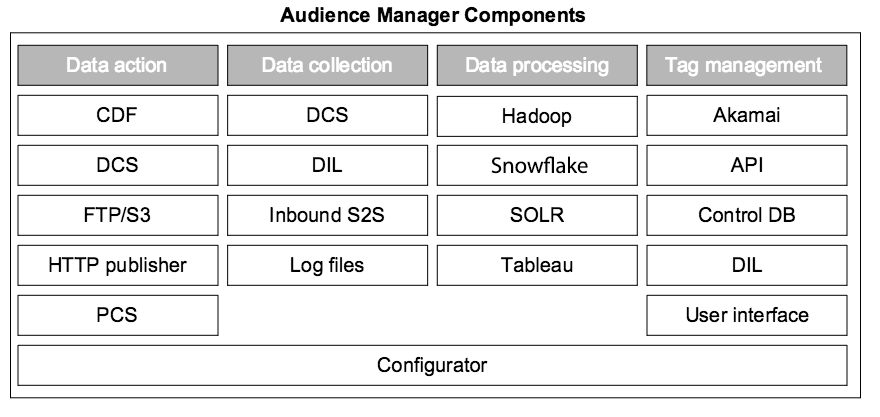

# Audience Manager系统中的关键组件{#key-components-in-the-audience-manager-system}

Audience Manager将其系统和流程分为四大类：标记管理、数据收集、数据整理和数据可操作性。

<!-- 

c_compstack.xml

 -->

下图显示了[!DNL Audience Manager]的主要组件和底层技术（硬件和软件）。 虽然某些流程执行特定的功能，而其他流程则具有多种作用，但所有系统都可协同工作，帮助您管理标记、收集数据、分析性能、与其他系统同步信息并对该信息执行操作。

