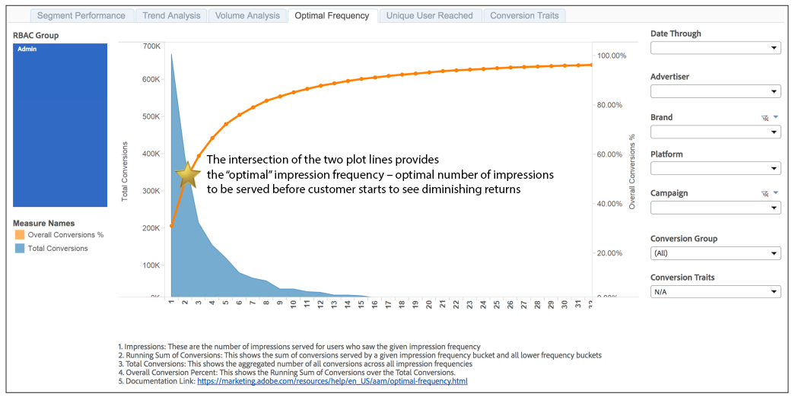

# 最佳频率报表{#optimal-frequency-report}

“最佳频率”报告可帮助您在提供的展示次数和转化率之间找到最佳平衡点。 它允许您调整要显示的展示次数，然后开始看到回报递减。

报表的回顾间隔为30天，从选择器中选择的日期开 [!UICONTROL Date Through] 始。

转换量通常随印象频率桶的增大而减小。 查看次数越多的用户越多。 这意味着这些较高频率的时段具有较少的转换率。

但是，总转换%会随每个印象频率桶而增加。 每个存储段会生成更多转换，因此转换总数（分子数）接近可能转换总数（分母），因此%会增加。

如示例报告中所示，2行图的交点为“最佳”印象频率（即在客户开始看到回报递减之前需要提供的最佳印象数）提供了指导。

## 示例报告

