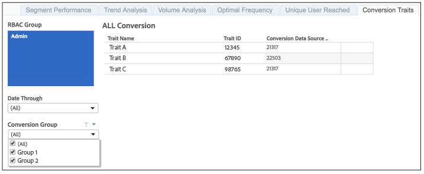

# 报告的转化特征{#reported-conversion-traits}

“转换特征”报表显示在特定日期标记为转换组转换特征的所有特征。

转换组的转换特征可以从报告运行更改为报告运行。 此报表按所选报告日期的转换组显示转换特征。

要了解如何在Audience Manager中创建转换特征，请观看以下视频：

>[!VIDEO](https://video.tv.adobe.com/v/23431/)

## 示例报告

您的[!UICONTROL Reported Conversion Traits]报表可能与以下报表类似：

