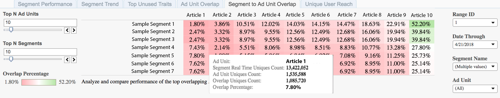

# 区段到广告单元重叠{#segment-to-ad-unit-overlap}

“区段到广告单元重叠”报告以热图表形式显示，突出显示广告单元与Audience Manager区段之间的高重叠和低重叠。

## 用例 {#use-cases}

通过[!UICONTROL Segment to Ad Unit Overlap]报告，您可以了解哪些受众访问您的Web属性。 报告显示[!DNL Audience Manager]区段成员之间的重叠以及Web属性的访客数。 重叠率越高，表示区段的许多成员都会访问您的Web资产。

## 使用区段添加设备重叠报告{#using-the-report}

使用&#x200B;**[!UICONTROL Top N Ad Units]**&#x200B;和&#x200B;**[!UICONTROL Top N Segments]**&#x200B;控件选择您所需数量的广告单位和区段以进行重叠。 每个项目最多可选择100个项目。

使用&#x200B;**日范围**&#x200B;和&#x200B;**日期至**&#x200B;控件调整回顾范围。 请注意，7天和30天回顾期仅适用于星期日日期。

使用&#x200B;**[!UICONTROL Segment Name]**&#x200B;和&#x200B;**[!UICONTROL Ad Unit]**&#x200B;框过滤任意区段和广告单元。

>[!IMPORTANT]
>
>启用[!UICONTROL Audience Optimization for Publishers]时，必须包含[!UICONTROL Ad Unit IDs]的描述性元数据，如[将Google Ad Manager（以前称为DFP）数据文件导入Audience Manager](../../../reporting/audience-optimization-reports/aor-publishers/import-dfp.md)的步骤3中所述。 通过执行此操作，您可以确保报告将web属性详细描述为[!UICONTROL Ad Unit]而不是[!UICONTROL Ad Unit ID]。

## 解释结果{#interpreting-results}

您的[!UICONTROL Segment to Ad Unit Overlap]报告可能与下面的报告类似。 将鼠标悬停在任何单元格上可获得有关该特定重叠的详细信息。 有关其他信息，请参阅示例报告下表中的说明。

<table id="table_22340F45B1B94D3796174CB30A60E212"> 
 <thead> 
  <tr> 
   <th colname="col1" class="entry"> 项目 </th> 
   <th colname="col2" class="entry"> 描述 </th> 
  </tr>
 </thead>
 <tbody> 
  <tr> 
   <td colname="col1"> 
 广告单元   
 </td> 
   <td colname="col2"> 
库存物料的名称。 例如，这可以是您的网站之一或您网站上的文章。 
 </td> 
  </tr> 
  <tr> 
   <td colname="col1"> 
 细分实时唯一值计数 
 </td> 
   <td colname="col2"> 
在指定的时间范围内实时查看的唯一访客数，以及在Audience Manager看到这些数据时，哪些数据符合区段的条件。 
 </td> 
  </tr> 
  <tr> 
   <td colname="col1"> 
 广告单位唯一值计数 
 </td> 
   <td colname="col2"> 
此特定广告单元的访客数。 此信息从Google Ad Manager日志中提取。 
 </td> 
  </tr> 
  <tr> 
   <td colname="col1"> 
 重叠唯一值计数 
 </td> 
   <td colname="col2"> 
您区段中接触到广告单元项的成员。 
 </td> 
  </tr> 
  <tr> 
   <td colname="col1"> 
 重叠百分比 
 </td> 
   <td colname="col2"> 
广告单位和细分群体之间的重叠。 这是重叠唯一值计数，表示为段实时唯一值的百分比。 
 </td> 
  </tr> 
 </tbody> 
</table>

