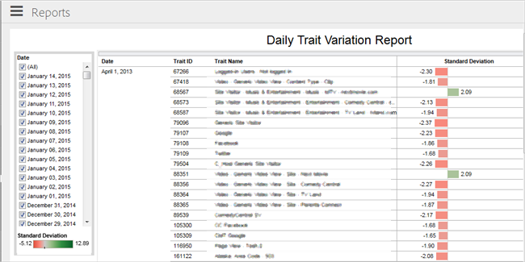

# Daily Trait Variation Report {#daily-trait-variation-report}

此报告返回在选定日期前30天内至少10，000次的特征列表，并且在同一时间间隔内的任一方向上的标准偏差大于或等于1.7。此报告可帮助您评估特征中特定用户的展示次数随时间发生波动的情况。

>[!NOTE]
>
>Audience Manager中的每日特征变化报告遵循CLUAC原则。You can only see traits from data sources that you have access to based on the [RBAC User Group](/help/using/features/administration/administration-overview.md) that you belong to.

标准偏差可测量平均值(或平均/预期值)的变化量或分散程度。标准偏差表示数据点趋向于非常接近平均值。高标准偏差表示数据点分散在大量值上。

Use the [!UICONTROL Date] list to select one or more dates for your report. 彩色条形图显示在列表底部，它提供了所有选定日期内所有特征的标准偏差范围的可视代表。黑色垂直线表示平均值。

The middle column contains a list of traits, identified by [!UICONTROL Trait ID] and [!UICONTROL Trait Name]. 单击任何特征可访问允许您从以下选项中进行选择的弹出对话框：

* **仅保留：** 删除报告中的所有其他特征，并仅显示此特征的数据。
* **排除：** 从报告中删除此特征，并显示所有其他特征的数据。您可以排除多个特征。
* **查看数据：** 允许您显示该行的数据。您还可以将所有行下载为文本文件。

[!UICONTROL Standard Deviation] 列显示彩色条形图，它们显示所选间隔上每个特征的标准偏差。红色条表示存在负标准偏差的特征(数据点趋向于低于平均值)。绿色栏指示正标准偏差的特征(数据点趋向于高于平均值)。将鼠标悬停在任何栏上，可显示一个弹出对话框，其中含有更多信息和选项，用于保留或排除该特征和查看更多信息。

图标显示在报表底部，允许您导出各种格式的数据，还原您可能对报表所做的任何更改(如排除特征)、启用或禁用自动更新，并刷新报告的数据。See [Report Icons and Tools Explained](../../reporting/dynamic-reports/interactive-report-technology.md#icons-tools-explained).

## 用例 {#use-cases}

**示例#1**：此报告在具有高季节性级别特征的情况下非常有用。例如，假设您的在线商店正在测试各种类型和价格的季节性促销。You have the following traits defined in [!DNL Audience Manager]:

* `productPage == "December Promotion"`
* `price > "500"`

Say you run the [!UICONTROL Daily Trait Variation] report on the 20th of December and you notice a solid positive deviation on the above mentioned traits in the past 30 days. 这可以建议访客在寻求季节性促销中提到的产品。为了利用这一趋势，您随后可以投入更多精力，针对感兴趣的访客定位特定产品类别的创意人员。

**示例#2**：此报告可帮助您识别与标记问题或特征错误配置相关的定位异常。想象一下，您已经根据在线商店的类别定义了以下特征：

* `productPage == "smartphones"`

由于您的商店重新配置，您将根据品牌名称将智能手机页面拆分为多个页面。However, you forget to update the traits defined in [!DNL Audience Manager].

One month later, you run the [!UICONTROL Daily Trait Variation] report and notice a large negative deviation on the `productPage == "smartphones"` trait, although your visitor number has increased, according to your site analytics. Based on this information, you realize that you haven't updated the traits in [!DNL Audience Manager] for your new product pages, so you know that you need to create the following traits:

* productPage==“sung”
* productPage==“apple”
* productPage==“weux”

一旦这样做，您会发现受众符合新创建的特征。
