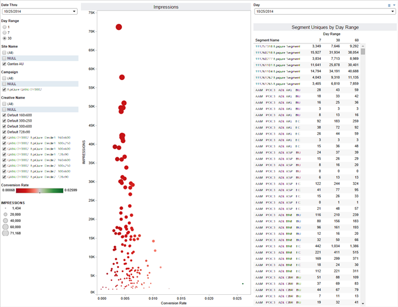

# Delivery and Performance Report{#delivery-and-performance-report}

返回印象和点击率的细分级别数据。

<!-- 

c_delivery_reports.xml

 -->

The [!UICONTROL Delivery and Performance] report lets you evaluate how segments perform on different advertiser sites. 作为优化工具，此报告可帮助您：

* 识别高性能细分，以便在其他营销活动或其他网站上重复使用。
* 查找和删除效果不佳的网站的细分。
* 直观地分析细分印象大小和点击率。

>[!NOTE]
>
>天视图每天更新。每周和30天回顾期每周更新。

选择单个点可在弹出窗口中查看数据详细信息。此外，您可以单击并拖动光标组，以返回有关这些数据元素的数据。这些操作会自动更新报告结果。

>[!MORE_ LIKE_ This]
>
>* [使用查找表改进日志文件处理时间](../../reporting/dynamic-reports/lookup-tables.md)
>* [使用数据滑块过滤报告结果](../../reporting/dynamic-reports/data-sliders.md)
>* [定义的交付和性能数据弹出字段定义](../../reporting/dynamic-reports/delivery-performance-report.md#field-definitions)
>* [交互式报告中使用的形状、颜色和大小](../../reporting/dynamic-reports/interactive-report-technology.md#shapes-colors-sizes)

## Delivery and Performance Data Pop Fields Defined {#field-definitions}

在单击单个数据点时，描述弹出窗口中显示的量度。

<!-- 

r_delivery_data_pop.xml

 -->

“交付和性能报告”弹出窗口包含以下指标：

| 量度 | 描述 |
|---|---|
| **[!UICONTROL Date Range Start]** | 报告使用的开始日期。 |
| **[!UICONTROL Date Range End]** | 报告使用的结束日期。 |
| **[!UICONTROL Segment ID]** | 该区段的唯一数字ID。 |
| **[!UICONTROL Segment Name]** | 区段的名称。 |
| **[!UICONTROL Clicks]** | 该区段录制的点击数。 |
| **[!UICONTROL Impressions]** | 该区段记录的次数数。 |
| **[!UICONTROL Reach]** | 唯一访客数。 |
| **[!UICONTROL Click Through]** | 访客点击广告的次数。 |

>[!MORE_ LIKE_ This]
>
>* [使用查找表改进日志文件处理时间](../../reporting/dynamic-reports/lookup-tables.md)

