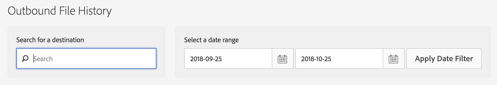

# 出站文件历史记录 {#outbound-file-history}

查看指定目标和时间期的出站批处理作业历史记录信息。

<!-- 

t_reports_outbound_history.xml

 -->

1. 单击&#x200B;**[!UICONTROL Analytics]** > **[!UICONTROL Outbound File History]**。

   

1. 在&#x200B;**[!UICONTROL Search for a Destination]**&#x200B;框中，开始键入并选择所需的目标。
1. 在&#x200B;**[!UICONTROL Select a Date Range]**&#x200B;框中，指定报告的开始日期和结束日期，然后单击&#x200B;**[!UICONTROL Apply Date Filter]**。

   

   下表包含与报表中的列对应的信息：

<table id="table_93076D46AC50411395E72B9B987E99BE"> 
 <thead> 
  <tr> 
   <th colname="col1" class="entry"> 线形图 </th> 
   <th colname="col2" class="entry"> 描述 </th> 
  </tr> 
 </thead>
 <tbody> 
  <tr> 
   <td colname="col1"> 数据同步文件名 </td> 
   <td colname="col2"> 
 Adobe为此目标生成的所有一起处理的出站文件列表。 
 </td> 
  </tr> 
  <tr> 
   <td colname="col1"> 成功 </td> 
   <td colname="col2"> 
从 Audience Manager成功发送到目标的记录数。 
 </td> 
  </tr> 
  <tr> 
   <td colname="col1"> 失败 </td> 
   <td colname="col2"> 
无法发送到目标的记录数。 
 </td> 
  </tr> 
  <tr> 
   <td colname="col1"> 已接收的记录 </td> 
   <td colname="col2"> 
文件中生成并尝试发送到目标的记录总数 Adobe。 在大多数情况下，这应该是成功文件和失败文件的总数。 
 </td> 
  </tr> 
 </tbody> 
</table>
