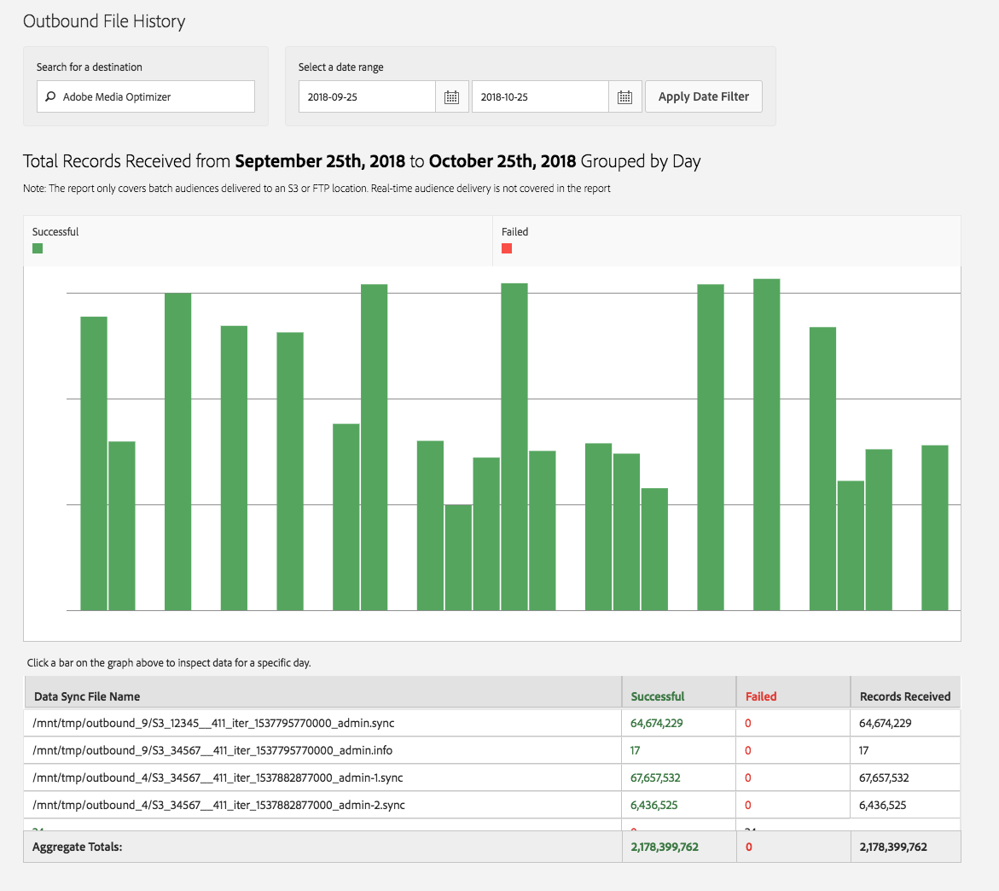

# 出站文件历史记录 {#outbound-file-history}

檢視指定目的地和時段的出站批次工作歷史記錄資訊。

<!-- 

t_reports_outbound_history.xml

 -->

1. 单击 **[!UICONTROL Analytics]** > **[!UICONTROL Outbound File History]**.

   

1. 在 **[!UICONTROL Search for a Destination]** 方塊中，開始輸入並選取想要的目的地。
1. 在 **[!UICONTROL Select a Date Range]** 方塊中，指定報表的開始和結束日期，然後按一下 **[!UICONTROL Apply Date Filter]**.

   

   下表包含與報表中各欄對應的資訊：

<table id="table_93076D46AC50411395E72B9B987E99BE"> 
 <thead> 
  <tr> 
   <th colname="col1" class="entry"> 折线图 </th> 
   <th colname="col2" class="entry"> 描述 </th> 
  </tr> 
 </thead>
 <tbody> 
  <tr> 
   <td colname="col1"> 資料同步檔案名稱 </td> 
   <td colname="col2"> 
所有輸出檔案的清單  Adobe 產生於一起處理的這個目的地。 
 </td> 
  </tr> 
  <tr> 
   <td colname="col1"> 成功 </td> 
   <td colname="col2"> 
成功傳送的記錄數  Audience Manager 到目的地。 
 </td> 
  </tr> 
  <tr> 
   <td colname="col1"> 失败 </td> 
   <td colname="col2"> 
無法傳送至目的地的記錄數。 
 </td> 
  </tr> 
  <tr> 
   <td colname="col1"> 已接收的記錄 </td> 
   <td colname="col2"> 
記錄總數  Adobe 產生並嘗試傳送至目的地。 在大多數情況下，這應該是成功檔案和失敗檔案的總數。 
 </td> 
  </tr> 
 </tbody> 
</table>
