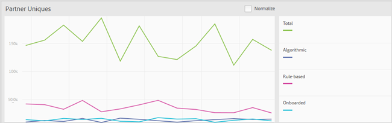

# 报表仪表板 {#reports-dashboard}

使用仪表板来视图指定时间范围内按特征类型和区段细分的唯一访客计数的相关信息。

<!-- 

c_dashboard.xml

 -->

[!DNL Audience Manager] 使 [!UICONTROL Role Based Access Control] 用[!UICONTROL RBAC]()将用户组权限扩展到 [!UICONTROL Dashboard]。用户只能看到关于他们具有仪表板权限的视图的信息。 [!UICONTROL RBAC] 功能，您可以控制内部团队能够报告哪些视图数据。

例如，管理不同广告商帐户的代理可以配置用户组权限，以便管理广告商A帐户的团队无法看到广告商B的报告数据。 此仪表板可用于解决投放问题。

例如，如果您注意到唯一用户类型（基于规则与已载入的用户）的细分，会导致唯一用户总数出现下降或尖峰，则您有一个更好的起点来跟踪潜在的数据投放问题。 如果您注意到唯一用户总数和已载入的唯一用户总数有所下降，您可以转到[!UICONTROL On-boarding Status]报告，查看入站文件是否有问题。

**要访问仪表板:**

1. 在顶部导航菜单中，单击&#x200B;**[!UICONTROL Dashboard]**。
2. *可* 选从下拉报告(7天、14天（默认）、30天或60天)中选择最后一个列表日期的所需时间范围。

   根据所选的期间，[!UICONTROL Largest Traits] > [!UICONTROL Most Changed Traits]和[!UICONTROL Largest Segments] > [!UICONTROL Most Changed Segments]面板中的增量变化显示在结束于今天的受众与相同长度的上一期间的中唯一访客的变化。 例如，如果选择“7天”，则增量将比较前七天内结束于今天的唯一访客与七天前结束的七天的唯一访客。

   >[!NOTE]
   >
   >您可以通过运行[!UICONTROL Trend]报告来调查看似异常的增量变化。 例如，如果您在过去七天中看到异常大的增量变化，则可以运行最近14天(2 x 7)的[!UICONTROL Trend]报告以更好地了解数字。

   根据登录用户的权限，将显示以下面板：

   * [Partner Uniques](../reporting/reports-dashboard.md#partner-uniques)
   * [最大特征／最改变特征](../reporting/reports-dashboard.md#largest-traits)
   * [最大细分／更改最多的细分](../reporting/reports-dashboard.md#most-changed-segments)

3. *可* 选单 **[!UICONTROL Normalize]** 击任意图形上方以显示相同比例的所有数据。您还可以将鼠标悬停在任何数据点上以查看更多信息。

## 合作伙伴单位{#partner-uniques}

视图需要权限：[!UICONTROL View All Traits]。

此面板显示指定时间范围内的唯一访客数。 个人、颜色编码行表示使用算法、基于规则和载入的特征捕获的唯一访客的总数和唯一访客的数量。

>[!NOTE]
>
>唯一访客的总数表示通过基于规则或载入的特征捕获的访客。 但是，唯一访客的总数不等于使用基于规则和载入的特征捕获的唯一访客的总和。 同一唯一用户可能在这两个特征类型中的任何一个中表示。

## 最大特征／最改变特征{#largest-traits}

视图需要权限：[!UICONTROL View Traits]。

此面板显示由各种特征捕获的唯一访客数。

使用&#x200B;**[!UICONTROL Show]**&#x200B;下拉列表显示有关不同类型特征的信息：[!UICONTROL All Traits]、[!UICONTROL Algorithmic]、[!UICONTROL Onboarded]或[!UICONTROL Rule-Based]。

此面板包含以下选项卡：

<table id="table_DA48BDEB4E0143BEA4EB85AC26FF6AE3"> 
 <thead> 
  <tr> 
   <th colname="col1" class="entry"> 制表符 </th> 
   <th colname="col2" class="entry"> 描述 </th> 
  </tr> 
 </thead>
 <tbody> 
  <tr> 
   <td colname="col1"> 
 最大特征 
 </td> 
   <td colname="col2"> 
显示有关按数字（最高到最低）排序的唯一访客数的信息，还列表指定时间范围内唯一访客的增量变化。 
 </td> 
  </tr> 
  <tr> 
   <td colname="col1"> 
 最改变的特征 
 </td> 
   <td colname="col2"> 
显示有关按增量更改排序的唯一访客数的信息。 
 </td> 
  </tr> 
 </tbody> 
</table>

## 最大区段／更改最多的区段{#most-changed-segments}

视图需要权限：[!UICONTROL View Segments]。

此面板实时显示各个区段捕获的唯一访客数。

此面板包含以下选项卡：

<table id="table_8E22E0579FA74C5A86CC40B40B2548BE"> 
 <thead> 
  <tr> 
   <th colname="col1" class="entry"> 制表符 </th> 
   <th colname="col2" class="entry"> 描述 </th> 
  </tr> 
 </thead>
 <tbody> 
  <tr> 
   <td colname="col1"> 
 最大细分 
 </td> 
   <td colname="col2"> 
显示有关指定时间范围内唯一访客数和唯一访客增量变化的信息。 
 </td> 
  </tr> 
  <tr> 
   <td colname="col1"> 
 更改最多的细分 
 </td> 
   <td colname="col2"> 
显示有关按增量更改排序的唯一访客数的信息。 
 </td> 
  </tr> 
 </tbody> 
</table>

