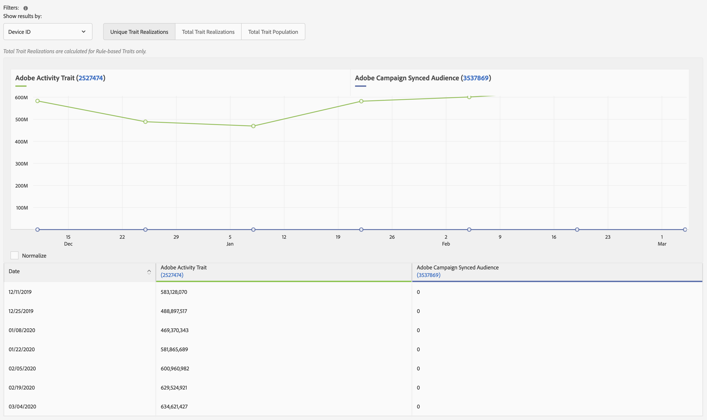

# 趋势报表{#trend-reports}

趨勢報表會傳回特徵和區段的趨勢資料。

## 概述 {#trend-report-overview}

<!-- 

c_trend_reports.xml

 -->

[!DNL Audience Manager] 使用 [!UICONTROL Role Based Access Control] ([!UICONTROL RBAC])將使用者群組許可權擴充至 [!UICONTROL Trend] 報表。 使用者在報告中只能看見他們有權檢視的特徵和區段。 [!UICONTROL RBAC] 功能可讓您控制內部團隊可以檢視哪些報告資料。

例如，管理不同廣告商帳戶的機構可以設定使用者群組許可權，這樣管理廣告商A帳戶的團隊就看不到廣告商B的報告資料。

執行 [!UICONTROL Trend] 報告您何時需要：

* 依特徵和區段檢閱趨勢資料。
* 依1、7、14、30、60和90天間隔追蹤趨勢。
* 比較一段時間內特徵和區段趨勢。
* 識別效能強大或效能不佳的特徵和區段。
* 匯出資料（.csv格式）以供進一步分析和共用。

下圖提供「 」中重要元素的高階概觀 [!UICONTROL Trend] 報告。

1. 配置以下选项：
   **報表型別：** 選取所需的報表型別（「特徵」或「區段」）。
   **日期範圍：** 指定報表的日期範圍（開始日期和結束日期）。
   **顯示間隔：** 指定顯示間隔（1、7、14、30、60和90天間隔）。
1. 依名稱或ID搜尋特徵或區段。
1. 從資料夾清單中，拖放您要報告的特徵或區段至 [!UICONTROL Selections] 右側面板。
1. 產生報表以圖形格式顯示資料，或將報表匯出為CSV格式。

## 執行趨勢報表 {#run-trend-report}

此程式說明如何執行 [!UICONTROL Trend] 報告。

<!-- 

t_working_with_trend_reports.xml

 -->

1. 在 **[!UICONTROL Analytics]** 儀表板，按一下 **[!UICONTROL Trend Reports]**.
1. 從 **[!UICONTROL Report Type]** 下拉式清單，選取所需的型別： **[!UICONTROL Trait]** 或 **[!UICONTROL Segment]**.
1. 按一下日期方塊以顯示行事曆，然後選取報表的開始和結束日期。
1. 指定顯示間隔：1、7、14、30、60或90天。
1. 依名稱或ID搜尋特徵或區段。
1. 從資料夾清單中，拖放您要報告的特徵或區段至 [!UICONTROL Selections] 右側面板。
   * 為獲得最佳效能，請執行 [!UICONTROL Trend] 一次報告少於20個特徵或區段。
1. 按一下 **[!UICONTROL Graph Traits]** 或 **[!UICONTROL Graph Segments]**，視您檢視的報表型別而定（「特徵」或「區段」）。 這些選項會忽略所有資料夾，而只顯示個別選取的特徵或區段。

   或

   按一下 **[!UICONTROL Export to CSV]** 將特徵或區段資料以及所有資料夾匯出為CSV格式，以供進一步分析和共用。 這會匯出 [!UICONTROL Unique Trait Realizations]， [!UICONTROL Total Trait Realizations]、和 [!UICONTROL Total Trait Population] 適用於所有日期範圍。

   >[!NOTE]
   >
   >[!UICONTROL Total Trait Realizations] 計算對象 [!UICONTROL Rule-based Traits] 僅限。

1. （選用）將滑鼠移至個別特徵或區段上方，即可顯示每個資料點的造訪次數和日期。 您可以按一下表格中的欄標題，以遞增或遞減順序排序結果。

## 特徵的趨勢報表結果 {#trend-report-results-traits}

當您執行 [!UICONTROL Trend Report] 並選取 **[!UICONTROL Trait]** 作為報表型別。

篩選結果依據 [!UICONTROL Device ID]：

* [!UICONTROL Unique Trait Realizations] 是在所選時間範圍內將特徵新增至其設定檔的匿名裝置訪客數量。
* [!UICONTROL Total Trait Realization] 是所選時間範圍內匿名滑鼠特徵實現的總數。
* [!UICONTROL Total Trait Population] 您的匿名裝置訪客在其設定檔中擁有此特徵的人數。

篩選結果依據 [!UICONTROL Cross-Device ID]：

* [!UICONTROL Unique Trait Realizations] 在選取的時間範圍內，已驗證身分的訪客新增特徵至其設定檔的數量。
* [!UICONTROL Total Trait Realization] 是所選時間範圍內已驗證的特徵實現總數。
* [!UICONTROL Total Trait Population] 是您的已驗證訪客在其設定檔中擁有此特徵的數量。

零表示 [!DNL Audience Manager] 未收集當天的資料。 空白專案表示該特徵不存在。

請觀看以下影片，詳細瞭解跨裝置量度的運作方式。

>[!VIDEO](https://experienceleague.adobe.com/docs/audience-manager-learn/tutorials/build-and-manage-audiences/profile-merge/understanding-cross-device-metrics-in-audience-manager.html)

## 區段的趨勢報表結果 {#segment-report-results-traits}

當您執行 [!UICONTROL Trend Report] 並選取 **[!UICONTROL Segments]** 作為報表型別。

* **[!UICONTROL Real-time Segment Population]**：在選取的時間範圍內符合區段資格的訪客數。
* **[!UICONTROL Total Segment Population]**：符合區段資格的訪客總數。

