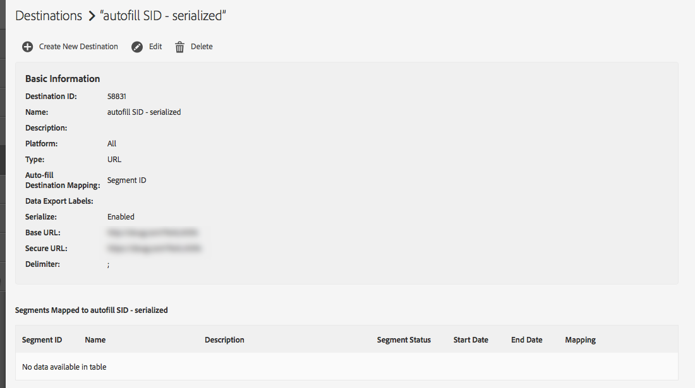

# 目标详细信息页面上是否应显示 Audience Lab 映射的区段？ {#audience-lab-segments-destination-page}

## 问题

我在 [!UICONTROL Audience Lab] 中创建了一些测试区段，并将其映射到了一个目标。但是，当我在目标详细信息页面上查找时，却看不到这些区段。

这是预期行为，还是错误？

## 回答

在 [!UICONTROL Audience Lab] 中创建且已映射的区段不会显示在目标详细信息页面上。

例如，如下面的屏幕截图所示，[!UICONTROL Test Segment 1] 和 [!UICONTROL Test Segment 2] 都已映射到 [!UICONTROL autofill SID - serialized] 目标。

这两个区段会在 Audience Lab 区段测试中显示：

但是，这两个区段不会在目标详细信息页面中显示：

