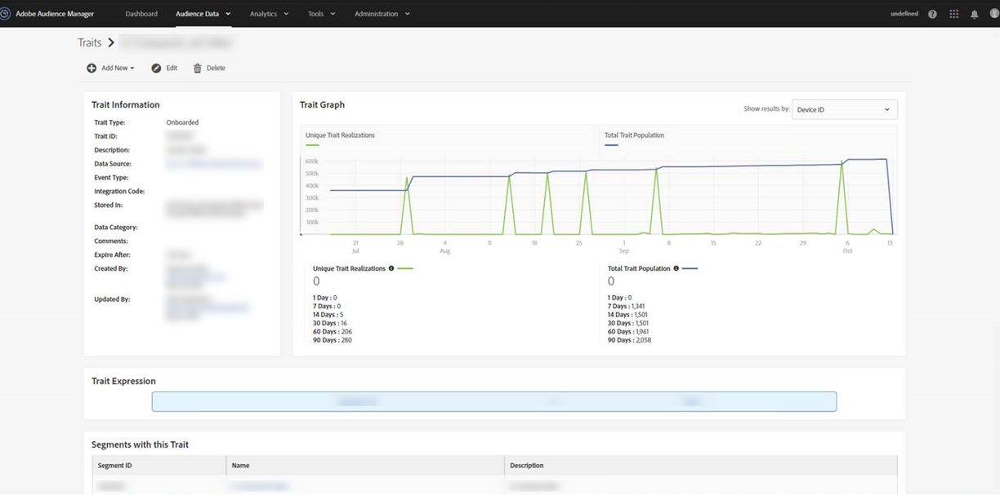

# 为什么我的已载入特征人口在 10 月 15 日左右降至 0？{#why-did-my-onboarded-trait-populations-drop-to-0-around-october}

## 问题

2019 年 10 月 14 日左右，我注意到设备 ID 图的已载入特征人口已降至 0，但以前这个数量要高得多。为什么会出现这种情况？

## 回答

10 月 15 日，对 Audience Manager 的“配置文件合并规则”功能更新进行了更改，现不再针对设备 ID 实现上传到跨设备数据源的 CRM ID 的已载入数据键控。以前，Audience Manager 会针对跨设备 ID（或 CRM ID）实现这一目的，并将这些实现复制到关联的 Audience Manager UUID（设备 ID）。做此更改是为了更准确地反映特征数据和要实现的配置文件的性质。

要查看特征实现，请从“Trait”视图右上角的下拉菜单中选择“Cross-Device ID”选项。

